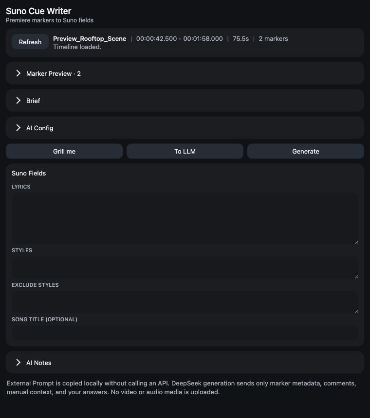

# Suno Cue Writer for Premiere Pro 2022

Suno Cue Writer is a CEP panel that turns Premiere Pro timeline markers inside the active sequence In/Out range into Suno Advanced / Custom Mode prompt fields.



## What It Does

- Reads active sequence timeline markers.
- Uses marker time, name, and comments as a film music cue brief.
- Optionally asks 2-4 AI context questions before generation.
- Calls DeepSeek `deepseek-v4-pro` with your own API key.
- Produces editable English `Lyrics`, `Styles`, `Exclude Styles`, `Song Title (Optional)`, and `AI Notes` fields.
- Builds an external LLM prompt that packages the same Premiere cue context for GPT, Gemini, or another model.

## Install for Local Testing

1. Copy the `SunoCueWriter` folder to your CEP extensions directory.
2. Enable unsigned CEP extensions for your Adobe install.
3. Open Premiere Pro 2022.
4. Open `Window > Extensions > Suno Cue Writer`.

Typical CEP extension folders:

- macOS user: `~/Library/Application Support/Adobe/CEP/extensions/`
- Windows user: `%APPDATA%/Adobe/CEP/extensions/`

## Workflow

1. Set In/Out points in the active sequence.
2. Add timeline markers with comments describing music intent.
3. Open the panel and click `Refresh Timeline`.
4. Optional: click `Grill me`, answer the AI questions, then generate.
5. Optional: click `To LLM` to copy the full context into another model for comparison.
6. Click `Generate`.
7. Copy fields into Suno Custom / Advanced mode and manually choose Instrumental or other Suno settings.

## Privacy

Only marker metadata, marker comments, manual scene brief text, and interview answers are sent to DeepSeek. The panel does not upload video or audio media.

## Development

Run tests:

```sh
npm test
```
